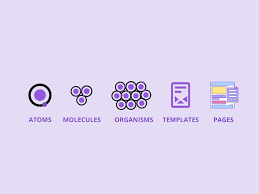

[BACK TO README](../README.md)

## Folder structure
- **public/** - assets (png, font, etc)
- **test/** tests end-to-end
- **src/**
  - **app/** - routing de [NextJS](https://beta.nextjs.org/docs/routing/fundamentals)
  - **lib/** 
    - **components/** - composants React, organisé avec l'[Atomic Design](#atomic-design)
      - **atoms/**
      - **molecules/**
      - **providers/**
      - **layouts/**
    - **hooks/** - hooks React
    - **api/** - support of the API generated automatically
    - **styles/** - Main styles
    - **utils/** - Utility files
    - **configs/** - config
    - **stores/** - stores Zustand
- **.storybook/** - StoryBook Configuration

## Atomic Design
The template used Atomic design pattern, this method split the website in 5 differents component:

### Atomic
Atom are the base componenent of the design system, such as: Button, text, labels, forms etc... 

They are located in our structure in the following location: `src/lib/components/atoms/`.

### Molecules
This is generally a groupes of atomes that work together to handle a specific task (such as a form with the search button ) or having a componet more complex that doesn't fit well in an atomic component. 

They are located in our structure in the following location: `src/lib/components/molecules/`.

### Layouts
Layouts is a component that usually include the content of a page, for example a navbar, sidebar, app-shell, panel etc...

They are located in our structure in the following location: `src/lib/components/layouts/`.

### Sections
Sections is part of a page, the page being devided in multiple section (example: header, about, our team,...) and contain themself some atomes or molecules.

They are located in a folder of a page ([See Routing from NextJS](https://beta.nextjs.org/docs/routing/fundamentals)).

### Pages
Pages contain a set of section or integrate molecules & atoms for the smallest page. the Page is usually part of the layout.

They are located in a folder of a page ([See Routing from NextJS](https://beta.nextjs.org/docs/routing/fundamentals)).